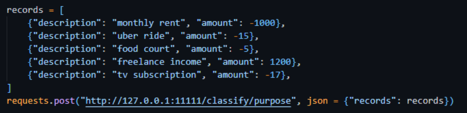
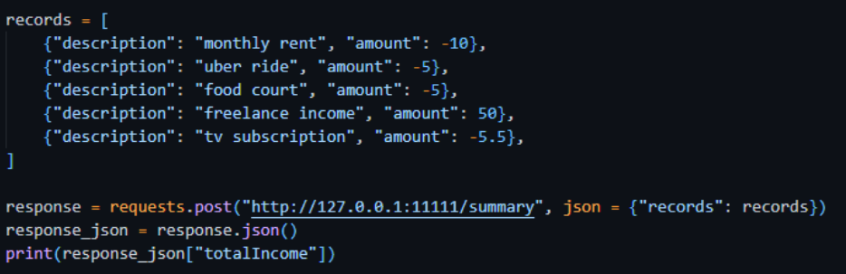
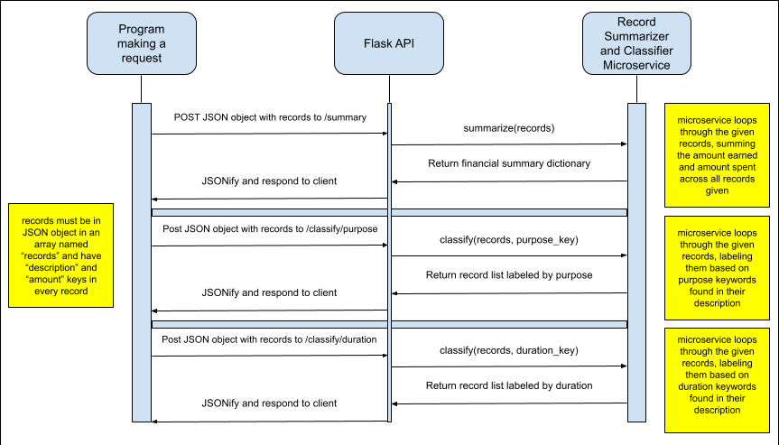

# Financial Record Summarizer and Classifier Microservice

This microservice takes lists of financial records and delivers either a financial summary of those records, or classifies each record by either purpose or duration through a REST API.

## Communication Contract

### Request

**Method**: POST

**Data Type**: application/json

**URL**: [http://127.0.0.1:11111](http://127.0.0.1:11111) or [http://localhost:11111](http://localhost:11111)

**Endpoints**:

* /summary  
* /classify/purpose  
* /classify/duration

**Body Format**:

* JSON array called “records” with a list of records, each with at least  
  * Description (any string)  
  * Amount (Any integer or float)

*The records passed to the microservice can contain other keys that are not listed, but must be included under “records” and at least each must contain a “description” and a numerical “amount”.*

Example Data:   
{  
  "records": \[  
    {  
      "description": "monthly rent",  
      "amount": \-1000  
      “date”: “June 2025”  
    },  
    {  
      "description": "went out to eat with family",  
      "amount": \-75  
    }  \]  
}

**Example Request (Python):**  

### Response

**Body Format**:

* /summary  
  * Returns a JSON object with the three numerical values listed below

    {  
      "totalIncome": 1200,  
      "totalExpense": \-1037,  
      "netSpending": 163

  }

* /classify/purpose and /classify/duration  
  * Returns all of the original financial records in a JSON array, as well as the new “classification” value

    \[  
      {  
        "description": "monthly rent",  
        "amount": \-1000,  
        "classification": "Housing",  
        “date”: “June 2025”  
      },  
      {  
        "description": "uber ride",  
        "amount": \-15,  
        "classification": "Transport"  
      }  
     \]

**Example Response Handler (Python):**

  
*Prints “50”*

### UML Diagram

